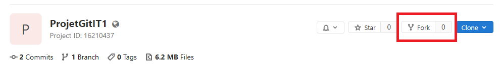
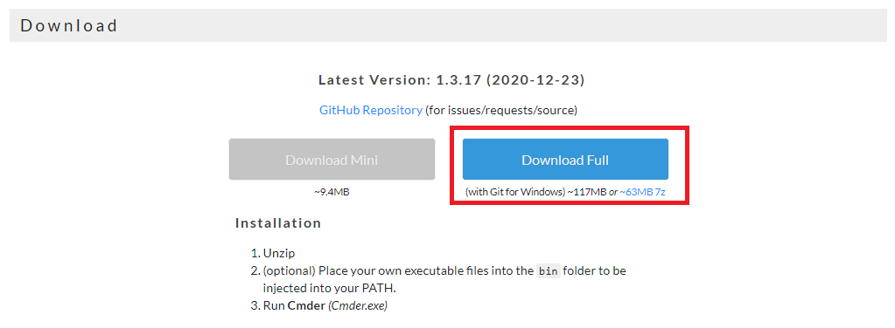
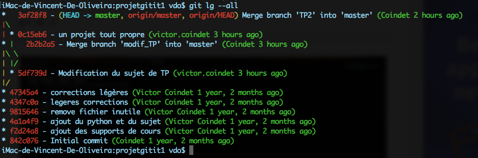
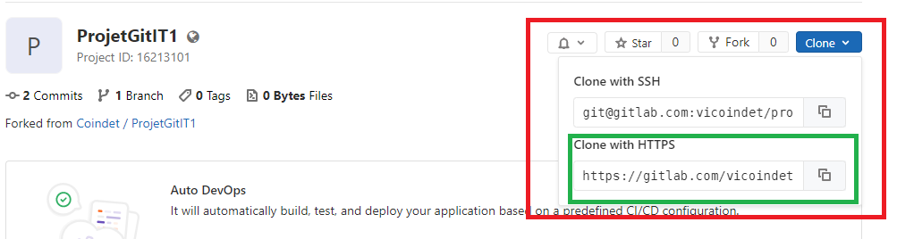
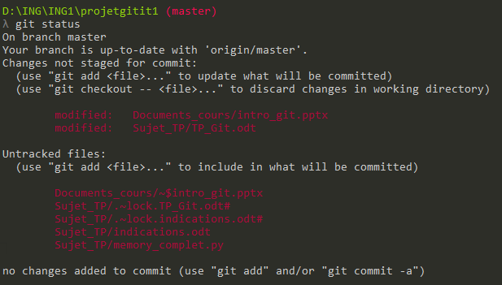
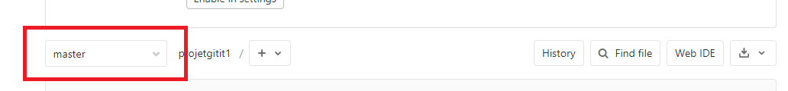
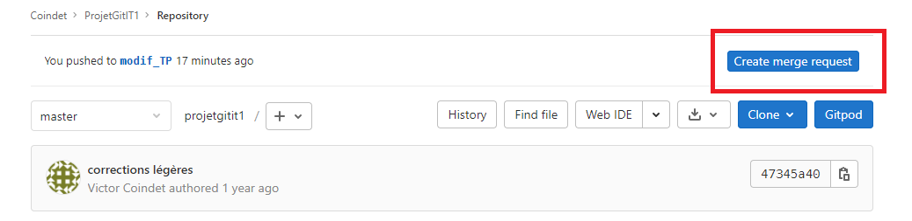
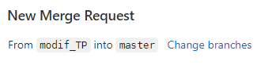
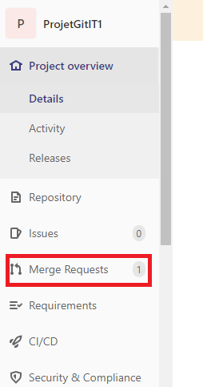
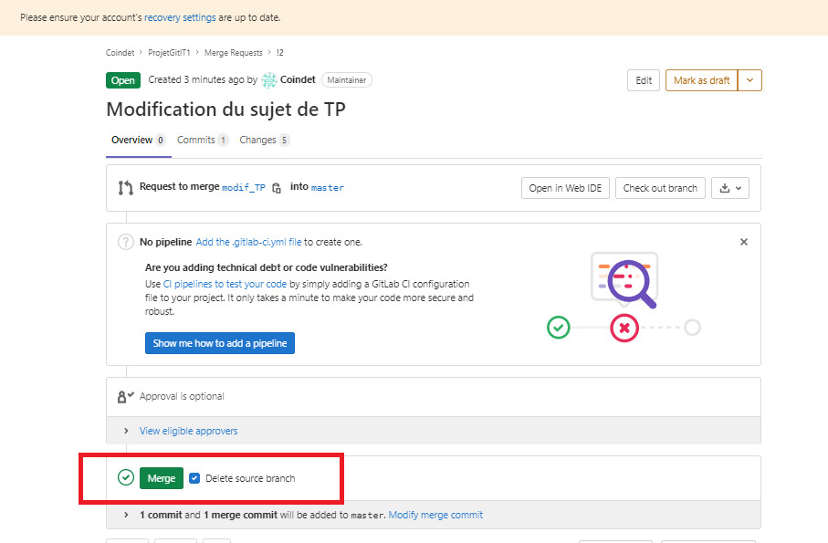

# TP GitLab – ING1

Le but de ce TP est de comprendre et de manipuler un minimum l’outil de versionnement Git, tout en découvrant un peu la plateforme GitLab.

Pour cela, il faudra d’abord vous créer un compte sur GitLab, puis de « forker » un projet déjà existant. Une fois le projet forké, vous trouverez les supports de cours, des documentations utiles ainsi que tous les documents relatifs à ce TP.

## 1 – Création d’un compte GitLab

La première étape est de se connecter sur l’interface GitLab.

Rendez-vous à l’adresse suivante : https://gitlab.com/users/sign_in, puis dans la partie « Register » créez-vous un compte.

Attention, mettez des « username » parlant (par exemple : première lettre du prénom puis le nom de famille). Ce compte GitLab pourra vous servir durant votre carrière professionnelle, même s’il est toujours possible de modifier son compte ultérieurement, ou d’en créer un nouveau.

Conseil : ne mettez pas votre adresse mail ENSG, car ces adresses sont détruites un an après votre sortie d’école, il peut donc être difficile de retrouver son compte en cas de mot de passe perdu.

## 2 – Création des groupes

Une fois votre compte créé, mettez vous par groupe de 3 ou 4. Il n’est pas nécessaire que vous soyez assis l’un à côté de l’autre dans la salle, il est même mieux si ce n’est pas le cas pour simuler un vrai projet avec des personnes travaillant à distance.

Une fois les groupes réalisés, désignez l’un d’entre vous comme « chef de projet ».

## 3 – Fork d’un projet existant (pour les chefs de projet)

Ce chef de projet, et seulement lui, va réaliser un fork du projet existant. Pour ce faire, allez sur la page : https://gitlab.com/vcoindet/projetgitit1. Vous vous retrouvez sur la page d’un dépôt git déjà existant. Il va donc falloir forker ce projet dans votre espace gitlab perso. Pour ce faire, il suffit de cliquer sur « fork » (voir ci dessous) :



GitLab vous propose alors de le forker dans votre « namespace » (à priori vous n’en avez qu’un seul).

En vous rendant sur la page d’accueil de GitLab, vous retrouvez le lien vers votre projet. Communiquez l’adresse aux membres de votre équipe.

## 4 – Configuration de GIT

### 4.1 – Prérequis :

Pour les élèves en distanciel et sur windows, il vous est recommandé de télécharger la version complète de cmder (avec git pour windows) : https://cmder.net/



Cmder est un émulateur Linux pour Windows. La version complète possède Git, ce qui vous sera plutôt pratique pour ce TP ! Rassurez-vous, cmder est juste un exécutable, ce qui veut dire que rien ne sera installé sur vos machines.

Pour les élèves sous Linux, vous pourrez tout faire depuis un terminal, Git étant natif sous les OS Unix.

### 4.2 – Configuration de Git

Tous : Vous devez configurer votre outil Git pour pouvoir pousser vos futures modifications en lui indiquant vos identifiants et votre adresse mail. Depuis un terminal ou Cmder, il vous faut lancer les commandes suivantes : (attention au double tiret -- sans espace entre les deux devant le mot globlal)

```bash
git config --global user.email "votre_adresse_mail"
git config --global user.name "votre_login_gitlab"
```

Si vous êtes à l’école, il faut configurer le proxy en lançant les commandes :

```bash
git config --global http.proxy http://10.0.4.2:3128
git config --global https.proxy http://10.0.4.2:3128
```

Pour un meilleur log, il peut aussi être intéressant d'ajouter un alias:

```bash
git config --global alias.lg "log --color --graph --pretty=format:'%Cred%h%Creset -%C(yellow)%d%Creset %s %Cgreen(%cr) %C(bold blue)<%an>%Creset' --abbrev-commit"
```

Puis ensuite, `git lg --all` vous donne



## 5 – Clone du projet

Maintenant, tous les membres de l’équipe doivent cloner le projet.

Avant de cloner le projet, depuis un terminal ou cmder, placez-vous dans la dossier où vous voulez cloner le dépôt git (cloner 1 dépôt = récupérer les sources qui sont sur gitlab, cela va créer un répertoire sur votre machine).

Sur le lien que votre chef de projet vous a envoyé, cliquez sur « clone » et copiez le lien https



Depuis un terminal, placez-vous dans le répertoire où vous voulez cloner le projet, et lancez la commande :

```bash
git clone [adresse_copiée]
```

Vous allez maintenant pouvoir commencer à travailler.

## 6 – Le projet

Le projet qui vous est fourni contient un dossier « Sujet_TP », vous y trouverez un document nommé « memory.py ». Ce code a pour but de créer le jeu du memory, mais il est buggé, il manque des fonctionnalités ainsi que la documentation de chaque fonction et le `__main__`.

Vous allez donc pouvoir vous répartir les taches suivantes :

- Debugger le code
- Ajouter les fonctionnalités manquantes
- Faire la documentation des fonctions
- Ajouter un main

Mais avant ça, vous allez devoir vous créer votre propre branche, on ne doit jamais coder sur la branche `master`.

Depuis votre terminal, placez vous dans le répertoire cloné, et lancez la commande :

```bash
git checkout -b [nom_de_votre_branche]
```

Vous êtes normalement directement sur la branche que vous venez de créer. Si ce n’est pas le cas, lancez la commande :

```bash
git checkout [nom_de_votre_branche]
```

Essayez de donner des noms de branches parlant (type : « debug », « documentation », etc.).

Pour pouvoir pousser votre branche sur le serveur délocalisé, il vous sera probablement nécessaire de lancer la commande suivante : 

```bash
git push --set-upstream origin [nom_de_ma_branche]
```

Cette commande permet d’indiquer à Git vers quel serveur et quel dépôt pousser votre branche.

Vous pouvez maintenant coder les taches qui vous sont données. (en utilisant spyder ou autre). **Le but n’est pas de perdre trop de temps sur la programmation, donc, même si vous n’avez pas quelque chose de fonctionnel, passez à l’étape suivante rapidement**.

## 7 – Pousser sa branche et ses modifications sur le serveur délocalisé.

Une fois que vous avez réalisé votre code, lancer les commandes suivantes :

```bash
git status
git add .
git commit -m "votre commentaire"
git push
```

- La première ligne, non obligatoire, permet de savoir quels fichiers ont été modifiés, et aussi sur quel branche vous vous situez, cela est vraiment fait à titre informatif ;



- La deuxième commande (`git add .`) permet « d’ajouter » les modifications que vous avez faites. On dit qu’on index nos modifications ;
- La troisième commande permet de commiter, ce qui, schématiquement, veut dire que nous préparons un point de sauvegarde. Il sera possible de revenir à ce point de sauvegarde, même après de nouvelles modifications de vos fichiers, même après avoir fait de nouveaux commits ou après avoir poussé votre code sur gitlab ;
- La quatrième sauvegarde permet de pousser votre code (ou votre branche) sur gitlab.

Allez ensuite sur la plateforme gitlab pour voir si vos modifications ont bien été poussées. Il s’agit de vérifier si votre branche a bien été poussée sur le serveur. Sur gitlab, vous pouvez visualiser les différentes branches comme ci-dessous :



## 8 – Merge avec la branche `master`.

Merge, qui veut dire fusionner, est une commande git qui permet de fusionner notre branche avec une autre (le but étant ici d’ajouter nos modifications dans la branche `master`). Mais pour faire les choses proprement, il faut faire ce qu’on appelle une « Merge Request »), mais il y a quelques étapes à respecter :

### 8.1 – Récupérer la branche `master` à jour

Une fois que vous avez terminé vos modifications, et que vous êtes sûr de votre coup, lancer les commandes suivantes :

```bash
git add .
git commit -m "votre message"
git pull
```

- La première ligne permet d’indexer vos modifications
- La deuxième ligne permet de commiter vos modifications.
- La troisième ligne permet de tirer les sources depuis le serveur. Attention, vous tirez toutes les branches qui ont été poussées sur le git, ainsi que la branche `master` avec les modifications que vos camarades ont pu y apporter.

### 8.2 – Fusionner la branche `master` et votre branche

Vérifiez bien que vous êtes sur votre branche, et non sur la branche `master`.

Lancez ensuite la commande :

```bash
git merge master
```

Cette commande permet d’ajouter toutes les modifications qui ont été apportées sur la branche `master` dans votre branche à vous. En effet, il se peut que vos collègues aient déjà apporté des modifications dans la branche `master`, sans que vous ne le sachiez.

A ce stade, ne poussez surtout pas directement sur le serveur. Il se peut qu’il ait des conflits qu’il faille gérer.

### 8.3 – Gérer les conflits

En ouvrant les fichiers de code que vous avez modifié, il est facile de repérer les potentiels conflits, ils sont matérialisés par des lignes qui ressemblent à ça : `>>>>>1546164356456<<<<<`
.
Il faut donc prendre en compte les modifications de vos collègues et les vôtres et les faire « cohabiter » dans votre code. Pour vous aider à gérer les conflits, vous pouvez installer smartgit sur vos machines (une fiche vous est fournie sur cet outil).

Une fois les conflits gérés, **vérifiez d’abord que le projet fonctionne toujours**, puis lancez les commandes :

```bash
git add .
git commit -m "nouveau message"
git push
```

Si vous avez géré des conflits, vous avez apporté de nouvelles modifications à vos fichiers, il faut donc relancer les commandes (`git add .` et `git commit`). La dernière commande (`git push`) permet de pousser vos modifications sur le serveur (donc les mises à jour de votre branche).

### 8.4 – Faire une Merge Request

Une fois que vous avez bien mis à jour votre branche avec la branche `master` et que vous avez poussé votre branche sur le serveur (dans cet ordre), vous pouvez créer une merge request depuis gitlab en cliquant sur « create merge request » :



Une fois que vous avez cliqué dessus, vous devez choisir quelle branche vous voulez merger avec la branche `master` (ici on demande d’ajouter la branche modif_TP dans la branche `master`) :



Remplissez bien le formulaire et assignez la merge request à votre chef de projet. En effet, seul lui peut accepter les merge requests qui ont pour but d’ajouter des modifications dans la branche `master` (cette branche `master` est protégée, et seul le propriétaire du dépôt git peut la modifier ou accepter les modifications).

Pour accepter une merge request, le chef de projet doit aller ici : 



Le chef de projet peut alors accepter la merge request (note : par défaut, gitlab vous propose de supprimer la branche que l’on veut fusionner dans la branche `master`. Ce n’est pas obligatoire, mais plus propre, cela évite d’avoir plein de branches…).



## 9 – Fin

Une fois que vous avez fait toutes ces étapes, vous pouvez les refaire indéfiniment !

Si votre branche ne vous sert plus, pensez à la supprimer depuis la plateforme GitLab, si ce n’est pas déjà fait.